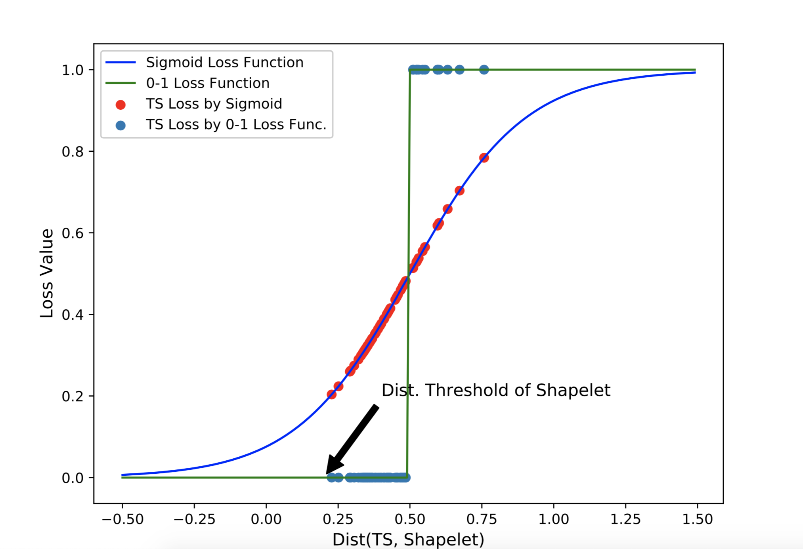
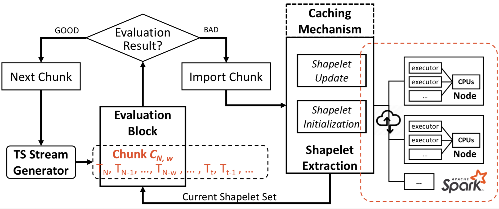
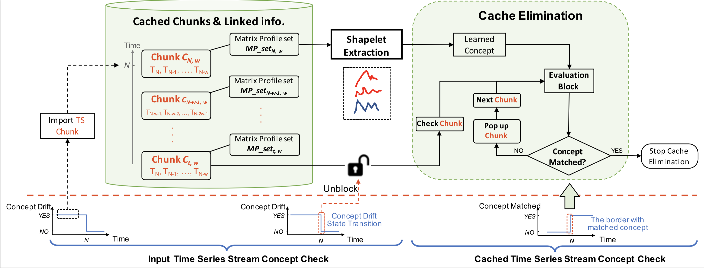

## Incremental and Adaptive Feature Exploration over Time Series Stream

DAVID Lab   Unversity of Versaille Saint-Quentin (UVSQ)  Université Paris-Saclay

### A demonstration video can be found here -> [Demo Video](https://drive.google.com/open?id=1-7RpKNIdMLYUuv1Fg7X7IlJMUrmkKwAb) [1]
 

By adopting the concepts Shapelet [2] and Matrix Profile [3], we conduct the first attempt to extract the incremental and adaptive features from Time Series Stream:
- For data source with stable concept, learning model will be updated incrementally; 
- For data source with Concept Drift, we extract the adaptive Shapelets under the most recent concept;
- An elastic caching mechanism allows to tackle the infinite TS instances in streaming context. 

### Configurations (demo)
- **Input File**: the name should be end with "Train.csv"
- **dataset_folder**: in each file, change the location of the datasets in the background. The selected input file will be saved/uploaded into this folder.
- **Data Augmentation**: refer to *preprocessing/TS_stream_preprocess.py*. As Shapelet-based methods (e.g., SMAP) are noise resistant, we put randomly the noise of random durations into the original TS data to augment the data volume. 

### Web application (demo)
- **ISETS_webapp.py**: main program, a web application based on Flask and Bokeh
- **ISETS_webbackend.py**: the program for adaptive shapelet extraction and Concept Drift detection
- **draw_adaptive_shapelets.py**: show the adaptive shapelets in the web interface
- **draw_TS_Stream.py**: show in real time the input TS instances in the stream

### Core algorithms
- **utils/**: the repository which contains the basic file operations and similairty measure functions
- **memory_block.py**: the caching mechanism including the computation of Matrix Profile for cached instance
- **SMAP_block.py**: Shapelet extraction on MAtrix Profile
- **evaluation_block.py**: the loss computation and the Concept Drift detection on TS Stream
- **adaptive_features/adaptive_features.py**: Concept Drift detection and adaptive feature extraction
- **ISMAP/ISAMP.py**: incremental Shapelet extraction on MAtrix Profile

### Main contributions:

1. A novel strategy to evaluate Shapelet, which shows the first attempt of transferring the techniques in Time Series community to Data Stream community 

   ​										  

   ​								Figure 1. Shapelet Evaluation by a loss-smoothed  approach.

2. Test-then-Train Stategy: The novel strategy, not only accelerates the incremental Shapelet extraction in stable-concept context, but also helps with detecting Concept Drift in streaming context.

   

3. Elastic Caching Mechanism in Streaming context

   

4. Scalability & Explainability 

   Based on SMAP (Shapelet extraction on MAtrix Profile) [4], our system is capable of being distributed in Spark environment. In addition, apart from the interpretability provided by Shapelet features, the system shows a strong explainability for Shapelet Extraction and Shapelet updating process. 

5. Traceability of extracted features
    

[1] J. Zuo, K. Zeitouni, and Y. Taher, “[ISETS: Incremental Shapelet Extraction from Time Series Stream](https://www.jingweizuo.com/publication/ECML_PKDD2019.pdf)“，(demo paper) ECML-PKDD’19

[2] L. Ye and E. Keogh, “[Time series shapelets: A New Primitive for Data Mining](https://www.cs.ucr.edu/~eamonn/shaplet.pdf),” in Proc. KDD 2009

[3] C. Yeh, Y. Zhu, L. Ulanova, and N. Begum, “[Matrix Profile I: All Pairs Similarity Joins for Time Series: A Unifying View that Includes Motifs, Discords and Shapelets](https://www.cs.ucr.edu/~eamonn/PID4481997_extend_Matrix%20Profile_I.pdf),” IEEE ICDM 2016

[4] J. Zuo, K. Zeitouni, and Y. Taher, “[Exploring interpretable features for large time series with se4tec](https://openproceedings.org/2019/conf/edbt/EDBT19_paper_353.pdf),” in Proc. EDBT 2019

